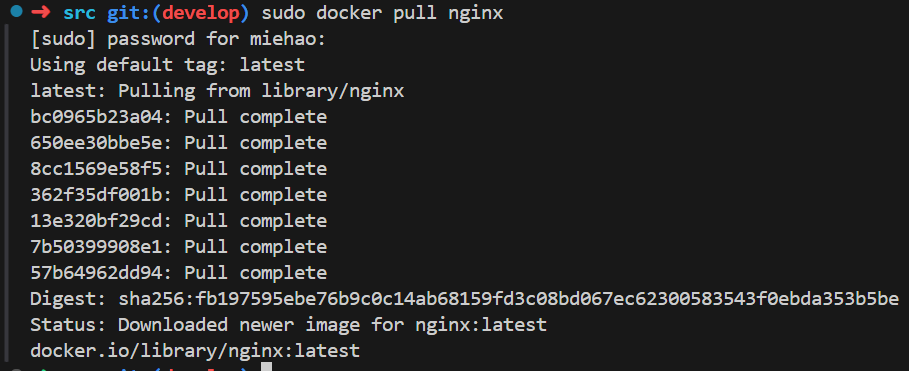

# DO5_SimpleDocker

## Part 1. Готовый докер

1 - Скачивание докер-образ  **nginx**

2 - Проверка наличия докер-образа

3 -Запуск докер-образ 

4 - Проверка запуска образа

5 - Размер контейнера

6 - Запамленные порты

7 - ip контейнера

### 

8 - Остановка докер контейнера

9 -Проверка остановки контейнера

10 - Запуск докера с портами 80 и 443 в контейнере, замапленными на такие же порты на локальной машине, через команду *run*.

11 - Проверка, что в браузере по адресу *localhost:80* доступна стартовая страница **nginx**

12 - Перезапуск и проверка докер контейнера 

### 

## Part 2. Операции с контейнером

1 -конфигурационный файл *nginx.conf* внутри докер контейнера

2 - Создание на локальной машине файла *nginx.conf*

3 - создаем файл *nginx.conf* внутрь докер-образа через команду `docker cp`

4 - Перезапуск **nginx** внутри докер-образа через команду *exec*

5 -Проверка по адресу [*localhost:80/status](http://localhost:80/statusб), что* отдается страничка со статусом сервера **nginx**

6 - Экспортирование контейнера в файл архив *.tar* через команду *export*

7 - Остановка контейнера

8 - Удали образа через `docker rmi [image_id|repository]`, не удаляя перед этим контейнеры.

Затем удаление остановленного контейнера

9 - Импортирование контейнера обратно через команду *import*

10 - Запуск импортированного контейнера

11 -Проверка, что по адресу *localhost:80/status* отдается страничка со статусом сервера **nginx**.

## Part 3. Мини веб-сервер

1 - Обновление библиотек

2 - мини-сервер на **C** и **FastCgi**, который возвращает простейшую страничку с надписью `Hello World!`

3- Запуск  мини-сервер через *spawn-fcgi* на порту 8080

*4 - nginx.conf*, который  проксирует все запросы с 81 порта на *127.0.0.1:8080*.

5 - Копирование файла *nginx.conf внутрь контейнера*

6 - Проверка, что в браузере по *localhost:81* отдается страничка

## Part 4. Свой докер

### 

1 -Докер-образ, который:

1) собирает исходники мини сервера на FastCgi;

2) запускает его на 8080 порту;

3) копирует внутрь образа написанный *./nginx/nginx.conf*;

4) запускает **nginx**.

2 - сборка докер-образа через `docker build` при этом указав имя и тег

3 - Проверка через `docker images`, что все собралось корректно.

4 - Запуск собранный докер-образ с маппингом 81 порта на 80 на локальной машине и маппингом папки *./nginx* внутрь контейнера по адресу, где лежат конфигурационные файлы **nginx**'а 

5 - Проверка, что по localhost:80 доступна страничка написанного мини сервера

6 - Добавление в *./nginx/nginx.conf* проксирование странички */status*, по которой отдавается статус сервера **nginx**

7 - Перезапуск докер-образа

8 - Проверка, что теперь по *localhost:80/status* отдается страничка со статусом **nginx**

## Part 5. **Dockle**

1 - сканирование образа из предыдущего задания через `dockle [image_id|repository]`

2 - Выделение корректировок докерфайла

3 - Исправленный образ  при проверке через **dockle** устранены ошибки и предупреждения

## Part 6. Базовый **Docker Compose**

1- файл *docker-compose.yml*, с помощью которого:

1) Поднимается докер-контейнер *(он должен работать в локальной сети, т. е. не нужно использовать инструкцию **EXPOSE** и мапить порты на локальную машину)*.

2) Поднимается докер-контейнер с **nginx**, который будет проксировать все запросы с 8080 порта на 81 порт первого контейнера.

### 

2  - Сборка и запуск проекта с помощью команд `docker-compose build` и `docker-compose up`.

3 - Проверка, что по localhost доступна страничка 

###